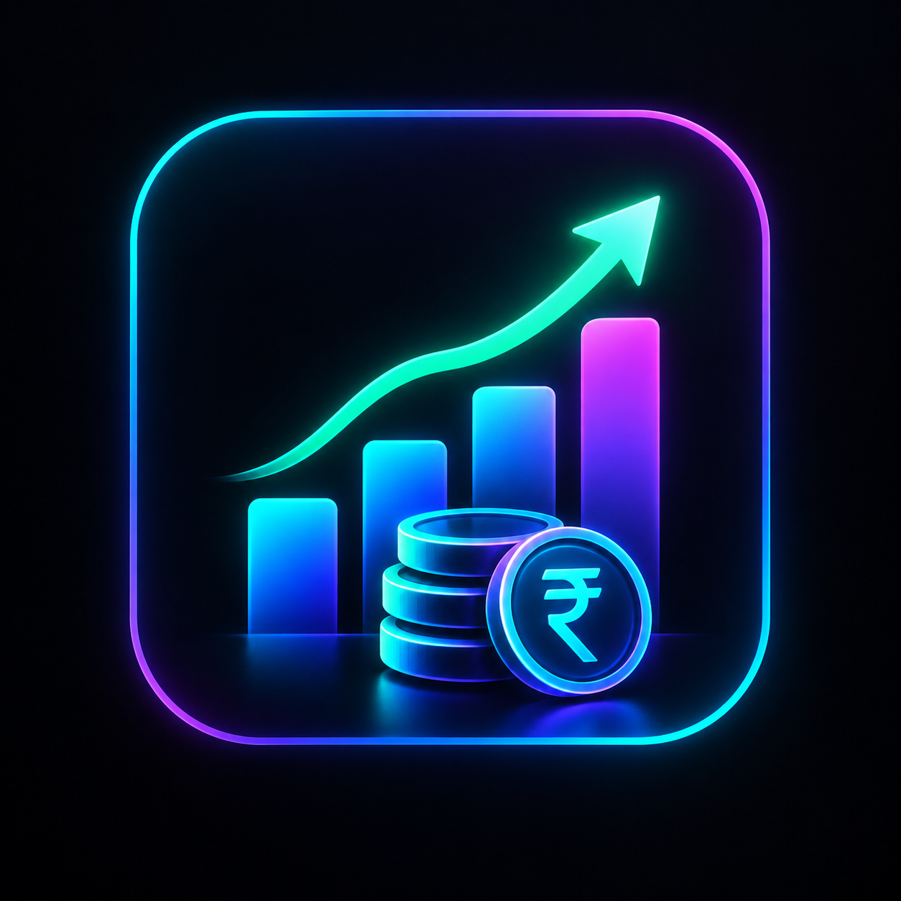

<div align="center">

  

  # Baba Wealth
  ### Offline-First, Zero-Knowledge Personal Wealth & Portfolio Manager

  [](LICENSE)
  [](https://www.electronjs.org/)
  [](https://react.dev/)
  [](https://vitejs.dev/)
  [](https://nodejs.org/api/crypto.html)
  [](https://github.com/)

  <p align="center">
    A sovereign, privacy-first desktop application engineered to track, analyze, and manage household wealth across stocks, mutual funds, fixed deposits, bonds, and digital assets with bank-grade local encryption.
  </p>

</div>

---

## 🌟 Overview

**Baba Wealth** (also packaged as **Finance Manager**) is an offline-first financial operating system designed for investors who demand total ownership of their personal financial data. 

Unlike conventional cloud-hosted portfolio trackers that ingest and monetize your financial footprint, Baba Wealth executes **100% locally on your machine**. All transactions, holdings, documents, and sensitive credentials are encrypted using **AES-256-GCM** with keys derived via **async Scrypt**. 

Whether tracking systematic investment plans (SIPs), calculating complex bond coupon schedules, reconciling CAS broker statements via local LLMs, or selectively masking assets in public spaces, Baba Wealth delivers institutional-grade functionality with a responsive cyberpunk-inspired interface.

---

## 🚀 Key Features

### 🔐 Zero-Knowledge Cryptographic Vault
* **Authenticated Encryption**: Every state change is serialized and secured with **AES-256-GCM** (Galois/Counter Mode) with a unique 96-bit initialization vector (IV) and authentication tag.
* **Key Derivation Function**: Uses asynchronous **Scrypt** (`N=16384`, `r=8`, `p=1`) with a cryptographically randomized salt, resisting brute-force and hardware acceleration attacks.
* **Ephemeral Memory Scrubbing**: Critical plaintext keys and intermediate buffer allocations are aggressively zeroed (`.fill(0)`) immediately after cryptographic operations.
* **Zero Telemetry**: No third-party analytics, remote tracking beacons, or cloud sync backdoors.

### 📊 Multi-Asset Portfolio Management
* **Equities & ETFs**: Track domestic (NSE/BSE) and international tickers with live price refreshes and average cost calculations.
* **Mutual Funds & SIP Engine**: Track folio numbers, scheme codes, and automated Systematic Investment Plans (SIPs) with scheduled monthly execution and annual step-up increments.
* **Fixed Deposits & Bonds**: Comprehensive yield engine supporting both cumulative interest compounding and periodic payouts (Monthly, Quarterly, Semi-Annual, Annual) with dynamic maturity tracking.
* **Alternative Investments**: Native tracking for Gold, Real Estate (REITs), Crypto, and Cash reserves.
* **Multi-Currency Normalization**: Automatic conversion across USD, EUR, GBP, AED, and SGD to base INR using real-time foreign exchange indices.

### 🥷 Granular Asset Stealth & Visibility Mode
* Selectively hide individual positions or specific high-value holdings from the Dashboard and Portfolio views.
* Hidden assets are completely excluded from displayed totals, allocation distributions, and P&L cards.
* **Uninterrupted Background Engine**: Daily interest accruals, SIP triggers, and live price feeds continue tracking in the background without pause.
* Interactive modal with real-time search, category filters, and an excluded-value calculator.

### 🤖 Local & Cloud AI Document Ingestion
* Parse Consolidated Account Statements (CAS), contract notes, and broker P&L reports (Zerodha, Groww, CAMS, KFintech).
* Supports **PDF**, **Excel (.xlsx, .xls)**, and **CSV** files.
* **Hybrid Intelligence**:
  * **Ollama (100% Local)**: Process confidential PDFs on your own hardware using models like `qwen2.5:3b`, `qwen2.5-coder:14b`, or `llama3`.
  * **Google Gemini API**: Cloud-accelerated multimodal parsing. API keys are stored encrypted at rest inside your personal vault.

### 🔄 Encrypted Portable Backups
* Export tamper-proof, single-file encrypted backups (`.fmvault`).
* Smart import pipeline with support for:
  * **Merge Mode**: Deduplicates and integrates new transactions and holdings without overwriting existing data.
  * **Full Replacement Mode**: Restores complete vault state from cold storage.

---

## 🛠️ Architecture & Tech Stack

```
┌─────────────────────────────────────────────────────────────┐
│                       React 19 Frontend                     │
│  Vite · Lucide React · Custom Dark Cyberpunk Design System │
└──────────────────────────────▲──────────────────────────────┘
                               │ IPC Bridge (contextBridge)
┌──────────────────────────────▼──────────────────────────────┐
│                    Electron Main Process                    │
│   Node.js Crypto (AES-256-GCM + Scrypt) · File System IPC   │
└───────────────┬─────────────────────────────┬───────────────┘
                │                             │
    ┌───────────▼────────────┐   ┌────────────▼──────────┐
    │  Document Extractors   │   │     AI Subsystem      │
    │ pdf-parse · xlsx · csv │   │ Local Ollama / Gemini │
    └────────────────────────┘   └───────────────────────┘
```

| Layer | Technologies |
| :--- | :--- |
| **Shell & Runtime** | [Electron 44](https://www.electronjs.org/) |
| **Frontend Framework** | [React 19](https://react.dev/), [Vite 8](https://vitejs.dev/) |
| **Styling** | Custom CSS3 Variable Neon Architecture, Orbitron Typography |
| **Cryptography** | Node.js `crypto` (`scrypt`, `aes-256-gcm`, `randomUUID`) |
| **Parsing Engine** | `pdf-parse`, `xlsx` (SheetJS), `papaparse` |
| **Packaging** | `electron-builder` (NSIS target for Windows x64) |

---

## 💻 Getting Started

### Prerequisites
* **Node.js**: `v18.0.0` or higher (`v20+` recommended)
* **npm**: `v9.0.0` or higher
* **Git** installed on your system

### 1. Clone the Repository
```bash
git clone https://github.com/harishc-dev/Finance-Manager.git
cd Finance-Manager
```

### 2. Install Dependencies
```bash
npm install
```

### 3. Run in Development Mode
Launch the Vite hot-reloading dev server and the Electron application concurrently:
```bash
npm run dev
```

### 4. Build Production Web Assets
Compile and minify the React application:
```bash
npm run build
```

### 5. Package Standalone Windows Installer (.exe)
Generate the production Windows NSIS installer:
```bash
npm run dist
```
The output executable will be created in the `release/` directory:
```
release/Finance Manager Setup 1.0.0.exe
```

---

## 🧠 AI Setup & Configuration

Baba Wealth allows you to extract holdings and transactions directly from financial statements. You can configure your AI provider in **Settings**:

### Option A: Local Ollama (Recommended for 100% Privacy)
1. Download and install [Ollama](https://ollama.ai/).
2. Pull a lightweight instruction model:
   ```bash
   ollama pull qwen2.5:3b
   ```
   *(For higher accuracy, you can use `ollama pull qwen2.5-coder:14b` or `llama3.2`)*
3. Ensure the Ollama daemon is running (`http://127.0.0.1:11434`).
4. In Baba Wealth, navigate to **Settings → AI Engine**:
   * Set **Upload AI Provider** to `Local Ollama only` or `Auto: Local → Gemini`.
   * Model Name: `qwen2.5:3b`.

### Option B: Google Gemini API
1. Obtain a free API key from [Google AI Studio](https://aistudio.google.com/).
2. In Baba Wealth, navigate to **Settings → Gemini API**:
   * Enter your key into the **Gemini API Key** field.
   * Model: `gemini-2.5-flash` (or `gemini-1.5-flash`).
3. Click **Save Settings**. Your API key is encrypted directly into your local `vault.enc` file and is never stored in plaintext.

---

## 🔒 Security Architecture

```
User Password ─────────┐
                       ▼
Random Salt (32B) ──► [Async Scrypt KDF] ──► 256-Bit Master Key
                                                      │
                    ┌─────────────────────────────────┴──────────────────────────────┐
                    │                                                                │
                    ▼                                                                ▼
         [AES-256-GCM Encryptor]                                          [AES-256-GCM Decryptor]
                    │                                                                ▲
                    ▼                                                                │
            [vault.enc on Disk] ─────────────────────────────────────────────────────┘
         (Ciphertext + 12B IV + 16B Auth Tag)
```

1. **Deterministic Master Key Isolation**: The application never stores your master password.
2. **Authenticated Ciphertext**: AES-GCM guarantees both confidentiality and integrity; any manual tampering with `vault.enc` causes immediate cryptographic decryption rejection.
3. **Document Encryption**: Attachments and broker statements uploaded to Documents are individually encrypted before being written to disk under the application's local user directory.

---

## 📂 Project Structure

```
neon-manager/
├── build/                      # Windows icon assets (.ico, .png)
├── electron/
│   ├── main.cjs                # Electron main process (Crypto, IPC, Window lifecycle)
│   └── preload.cjs             # Secure contextBridge API exposing vault methods
├── public/                     # Static assets bundled into production builds
│   ├── logo.png
│   └── Profile.jpeg
├── src/
│   ├── main.jsx                # Unified React application & state container
├── .gitignore                  # Git ignore rules for node_modules, release, & vault
├── LICENSE                     # MIT License
├── index.html                  # Main application HTML shell
├── package.json                # Project dependencies, scripts, and build metadata
└── vite.config.js              # Vite configuration with relative base resolution
```

---

## 🤝 Contributing

Contributions are welcome! If you would like to enhance asset support, optimize document parsing rules, or add new themes:

1. Fork the Project.
2. Create your Feature Branch (`git checkout -b feature/AmazingFeature`).
3. Commit your Changes (`git commit -m 'Add some AmazingFeature'`).
4. Push to the Branch (`git push origin feature/AmazingFeature`).
5. Open a Pull Request.

---

## 📄 License

Distributed under the **MIT License**. See [`LICENSE`](LICENSE) for more information.

---

---

## ⭐ Show Your Support

If this project helps your event or inspires your work, please consider giving it a ⭐ on GitHub!

---
## 👨‍💻 Author

**Harish C**

[](https://harishc-dev.netlify.app)
[](https://github.com/harishc-dev)

---
